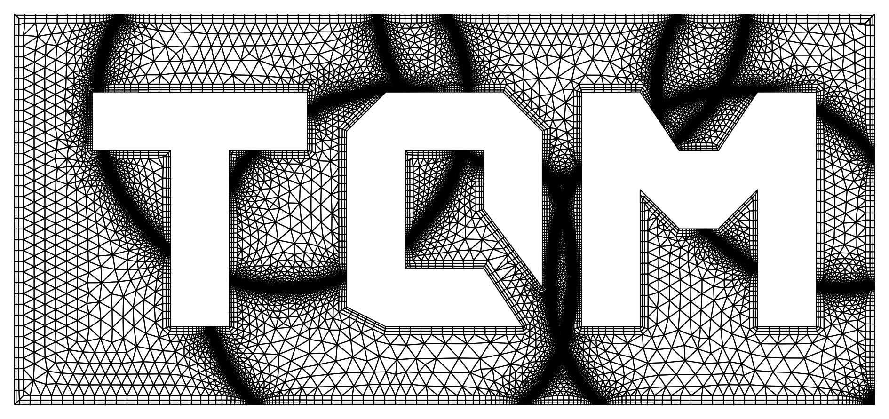
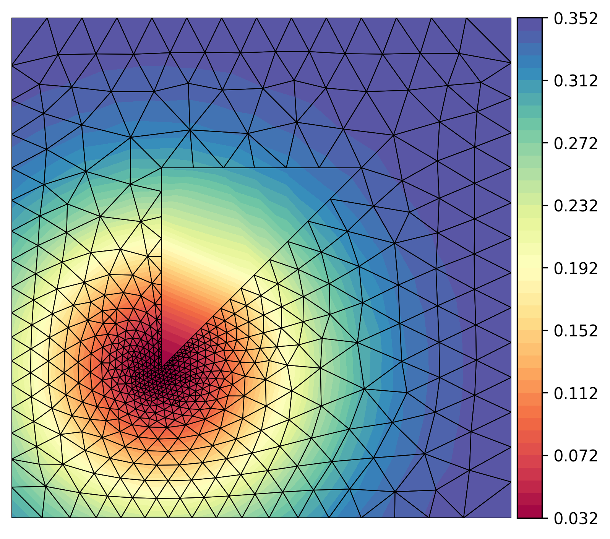
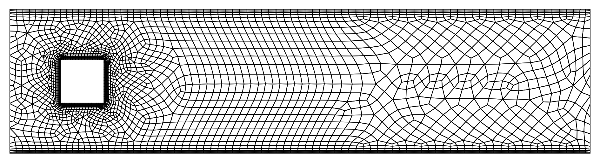
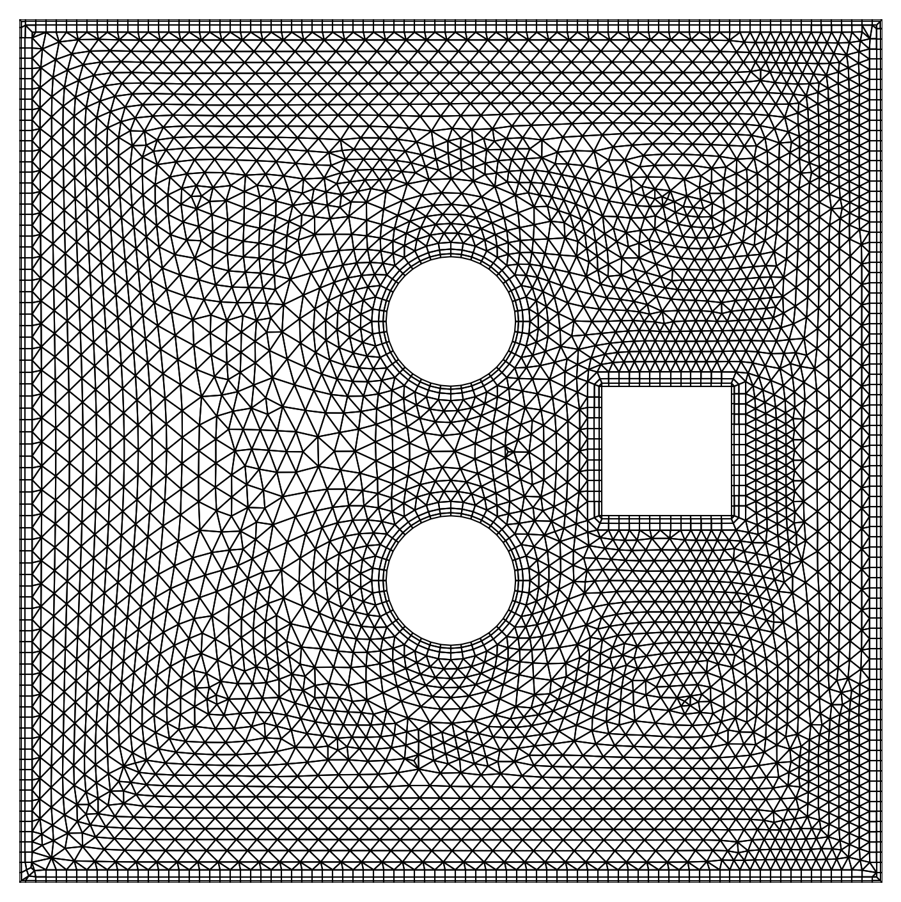
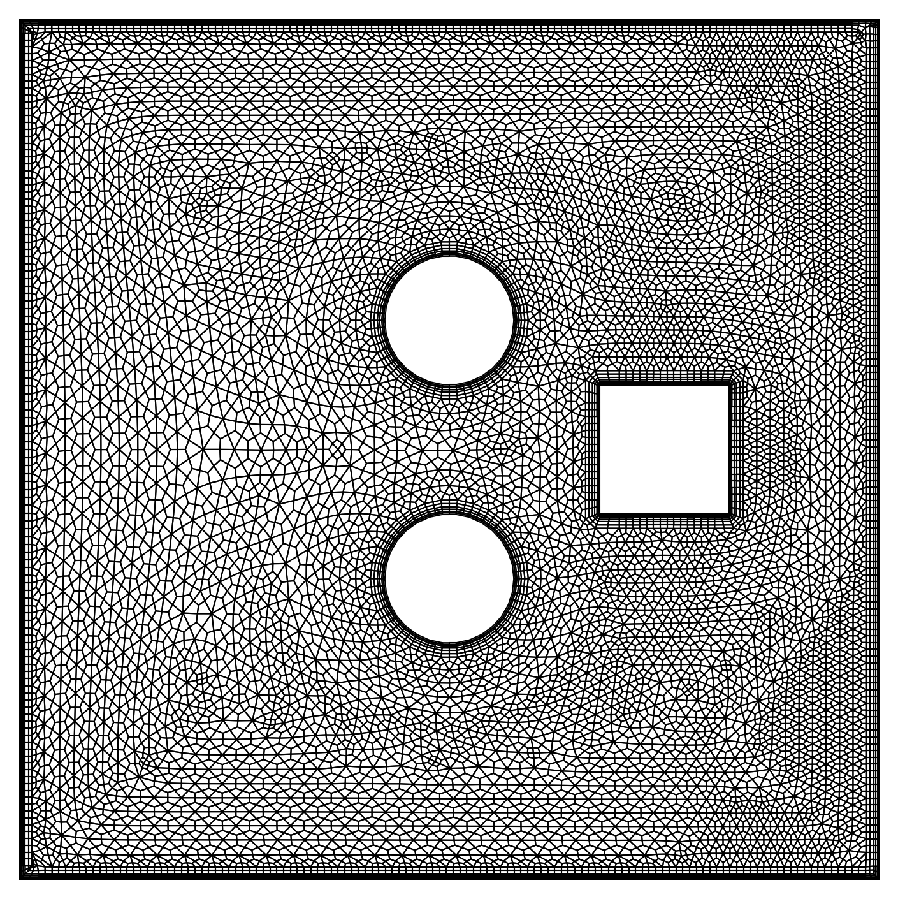
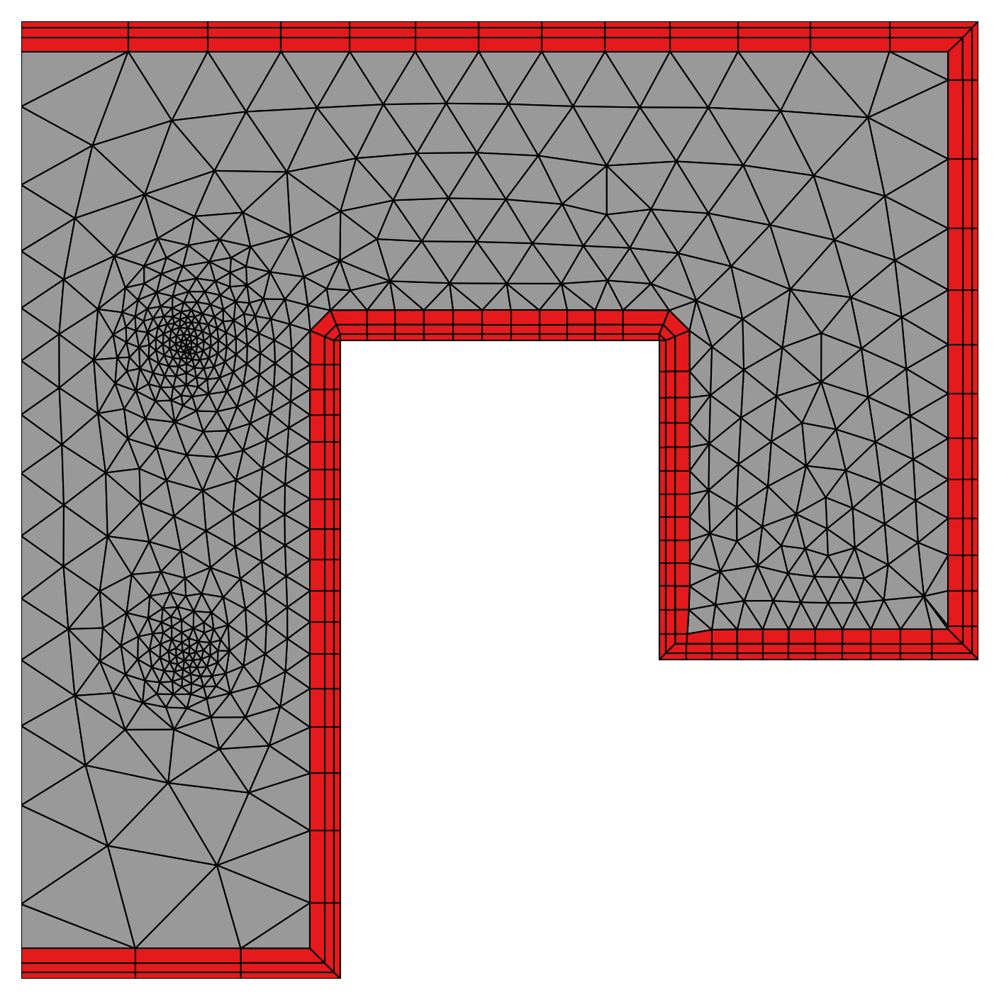
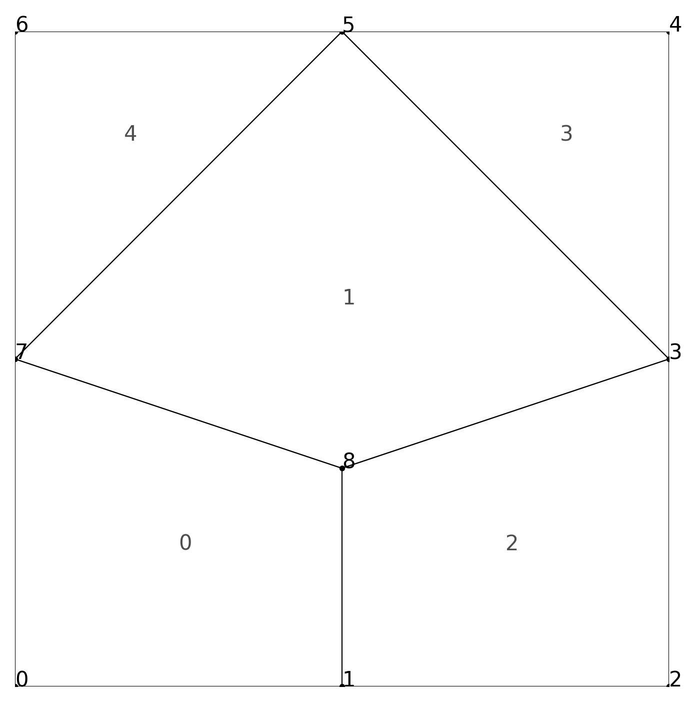
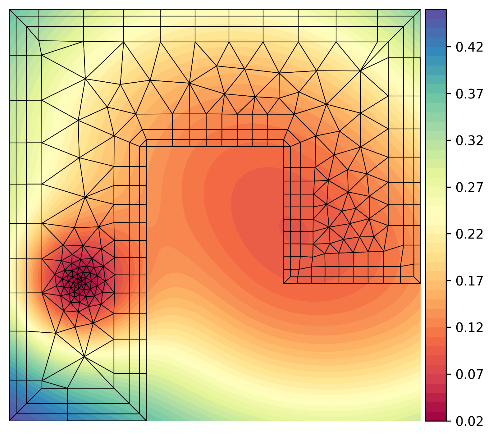
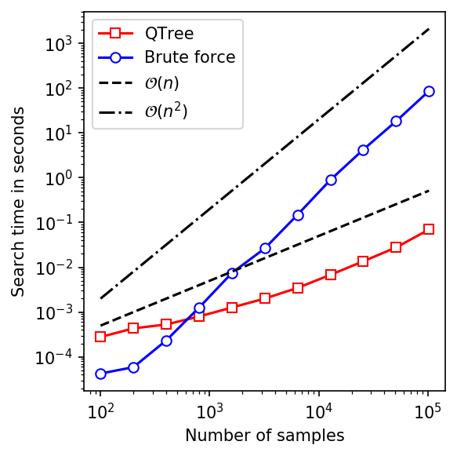

# TQMesh
-----------------------


**TQMesh** is a simple C++ library/application for the generation of two-dimensional meshes, that consist of triangles and quadrilaterals.
The application is intended for learning purposes, e.g. to easily create two-dimensional grids for Computational Fluid Dynamics or Finite Element Methods.
The elements are generated with an advancing-front method, where the user must define edge segments that define the boundary of the domain to tesselate. 
A user-defined size function makes it easy to adjust the element size locally.
**TQMesh** also offers the possibility to treat the near boundary region explicitly with quadrilateral elements. 
This might especially be helpful for the discretization of Computational Fluid Dynamics problems.

## Installation
**TQMesh** is a header-only library, which requires the files in the directories *src/algorithm* and *src/utils*.
The directory *src/app* contains the code for the application, that is described below.
For installation, simply create a build directory and run 
```sh
cmake ..
make install
```

## Usage of the TQMesh library
Several examples on how to use the **TQMesh**-library functions are given in the *src/examples* directory.
After installation, you can run them simply with 
```sh
./bin/run_examples <Example-ID>
```

## Usage of the TQMesh application
The **TQMesh** application uses simple parameter files as input for the mesh generation.
There are some sample files given in the *input/* directory.

To start the application, run 
```sh
./bin/TQMesh <Input-file> 
```
from your command line.

## Examples
For the mesh generation, you simply need to define a few global parameters and the mesh boundaries in terms of boundary nodes and edges. 
There is the possibility to assign markers to each defined boundary-edge. 
These markers are then assigned to the final mesh boundary edges.
It is also possible to create several meshes successively and assign color values to their elements.
For a better overview on the capabilities of **TQMesh**, check out the examples below. 
These are also the results of the examples given in the *input/* and the *src/examples* directories.

<details>
<summary>Example 1</summary>

This example shows a triangular mesh which features local element refinement. 
The element size is determined either by the domain's edge segments, through sizing factors that are attributed to boundary vertices or through a size function which is defined by the user.


</details>

<details>
<summary>Example 2</summary>

**TQMesh** also features the generation of quadrilateral elements, as well as layers of quad elements in the vicinity of boundaries.
This example mesh was created by using the paving algorithm (which generates mixed-element meshes that are dominated by quads) and a subsequent quad-refinement of all elements.
In this way, it is possile to generate elements that consist only of quadrilaterals.




</details>

<details>
<summary>Example 3</summary>

It is possible to create meshes through predefined boundary shapes, such as rectangles, circles or triangles.




</details>

<details>
<summary>Example 4</summary>

During the meshing process, each element gets an associated color value. 
These colors can be adjusted during the meshing process, as indicated in this example.
It also possible to define interior mesh vertices, in order to influence the local element refinement, as shown below.


</details>

<details>
<summary>Example 5</summary>

**TQMesh** gives also the possibility to create and merge several meshes, preserving the conformity of their boundary edges.
This makes it even easier to assign different color values to different element areas in the domain.


</details>


## Output format
Currently, **TQMesh** features the VTU output format (which can be read for example by Paraview) or alternatively a simple text output format.

<details>
<summary>More infos about the text output format </summary>

The following sample text output was generated for this mesh:



``` sh
MESH 1
VERTICES 9            # The total number of mesh vertices
1.00000,0.00000       # Coordinates of vertex 0
1.50000,0.00000       # Coordinates of vertex 1
2.00000,0.00000       # ...
2.00000,0.50000
2.00000,1.00000
1.50000,1.00000
1.00000,1.00000
1.00000,0.50000
1.50000,0.33319
INTERIOREDGES 5       # The total number of interior mesh edges 
   5,   7,   1,   4   # The first edge connects vertex 5 & 7 and has the
   7,   8,   1,   0   # adjacent elements (1,4) to the left and right of it
   3,   5,   1,   3   # ...
   3,   8,   2,   1
   8,   1,   2,   0
BOUNDARYEDGES 8       # The total number of boundary mesh edges
   0,   1,   0,   2   # The first edge connects vertex 0 & 1, is 
   1,   2,   2,   2   # adjacent to element 0 and has marker 2
   2,   3,   2,   2   # .....
   3,   4,   3,   2
   4,   5,   3,   2
   5,   6,   4,   2
   6,   7,   4,   1
   7,   0,   0,   1
INTERFACEEDGES 2          # The total number of interface edges between two neighboring meshes
   6,   7,   4,   2,   2  # This interface edge connects vertices 6 and 7. It is adjacent to 
   7,   0,   0,   1,   2  # element 4 of this mesh and to element 2 of another mesh with index 2
FRONT 0                   # Remaining advancing front edges after a failed meshing attempt
QUADS 3                   # The total number of quadrilateral elements
   0,   1,   8,   7,   2  # Quadrilateral made up of vertices 0, 1, 8 & 7. 
   7,   8,   3,   5,   2  # The quad has the color value 2
   8,   1,   2,   3,   2  # ...
TRIANGLES 2               # The total number of triangular elements
   3,   4,   5,   2       # Triangle made up of vertices 3, 4 & 5. Its color value is 2
   5,   6,   7,   2       # ...
QUADNEIGHBORS 3
   2,   1,  -1,  -1       # Element indices from the neighbors of quadrilateral 0
   2,   3,   4,   0       # The index -1 indicates a mesh boundary adjacency
  -1,  -1,   1,   0       
TRIANGLENEIGHBORS 2
  -1,   1,  -1            # Element indices of the neighbors of triangle 0
  -1,   1,  -1            # The index -1 indicates a mesh boundary adjacency 
SIZEFUNCTION 9            
0.50000                   # Size function value of vertex 0
0.50000                   # Size function value of vertex 1 
0.50000                   # ...
0.50000
0.50000
0.50000
0.50000
0.50000
0.50000
```
For the adjacency lists, quadrilateral and triangular elements are indexed together. 
This means, for example, if the mesh consists of 400 triangles and 300 quads, then quad 1 has element index 1 and triangle 1 has element index 401.
The last entry of the mesh output refers to the size function values at every vertex of the mesh.

</details>


## Plot your meshes
A simple python script to plot your mesh is provided under `scripts/plot_mesh.py`.
It requires the mesh given in the format described above.
Simply run it with
```sh
python scipts/plot_mesh.py Mesh.txt (-s -v -e -b -f)
```
Optional flags: 
* `-s`: Add a contour plot of the underlying size-function
* `-c`: Plot elements with their respective color values
* `-v`: Add the mesh vertices and their indices to the plot
* `-e`: Add the mesh element indices to the plot
* `-b`: Highlight the mesh boundaries 
* `-f`: Highlight remaining advancing front edges (in case of a failed meshing attempt) 




## Tests / Benchmarks
**TQMesh** uses a customized QuadTree container structure to store and access all mesh entities. 
The following plots show some performance statistics.

 

## To Do's
* Delaunay refinement for bad / highly skewed elements
* Export to different mesh output formats
* Improved documentation / testing

Feel free to contribute!

## Libraries used
* [exprtk.h - C++ Mathematical Expression Toolkit Library](http://www.partow.net/programming/exprtk/index.html)

## Sources
* o'Rourke, Joseph. Computational geometry in C. Cambridge university press, 1998.
* [Shewchuk, Jonathan R. Lecture Notes on Delaunay Mesh Generation, February 5, 2012](https://people.eecs.berkeley.edu/~jrs/meshpapers/delnotes.pdf)
* [Jonathan R. Shewchuk's free course material on Mesh Generation and Geometry Processing in Graphics, Engineering, and Modeling ](https://people.eecs.berkeley.edu/~jrs/mesh/)
* Lo, Daniel SH. Finite element mesh generation. CRC Press, 2014
* Blazek, Jiri. Computational fluid dynamics: principles and applications. Butterworth-Heinemann, 2015
* [Zhou and Shimada, An Angle-Based Approach to Two-Dimensional Mesh Smoothing, IMR 2000, 373-384, 2000](https://www.researchgate.net/profile/Kenji-Shimada-2/publication/221561796_An_Angle-Based_Approach_to_Two-Dimensional_Mesh_Smoothing/links/0deec53988e9f560ec000000/An-Angle-Based-Approach-to-Two-Dimensional-Mesh-Smoothing.pdf) 

## Licences
The project is licensed under the MIT License - see the LICENSE file for details.

