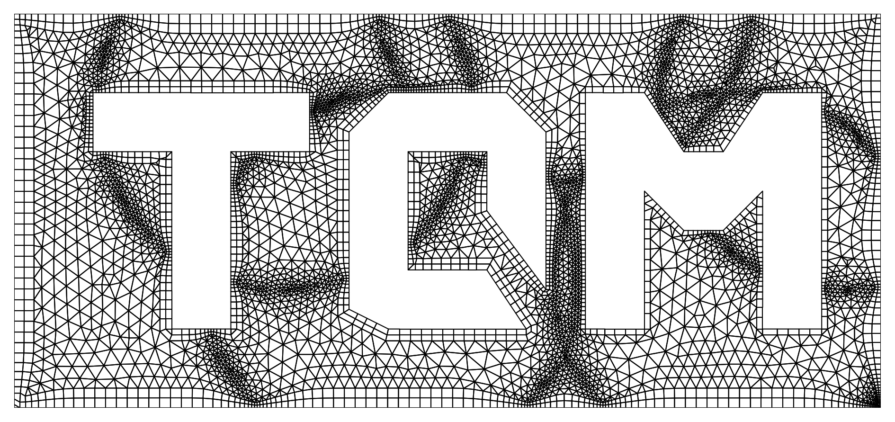
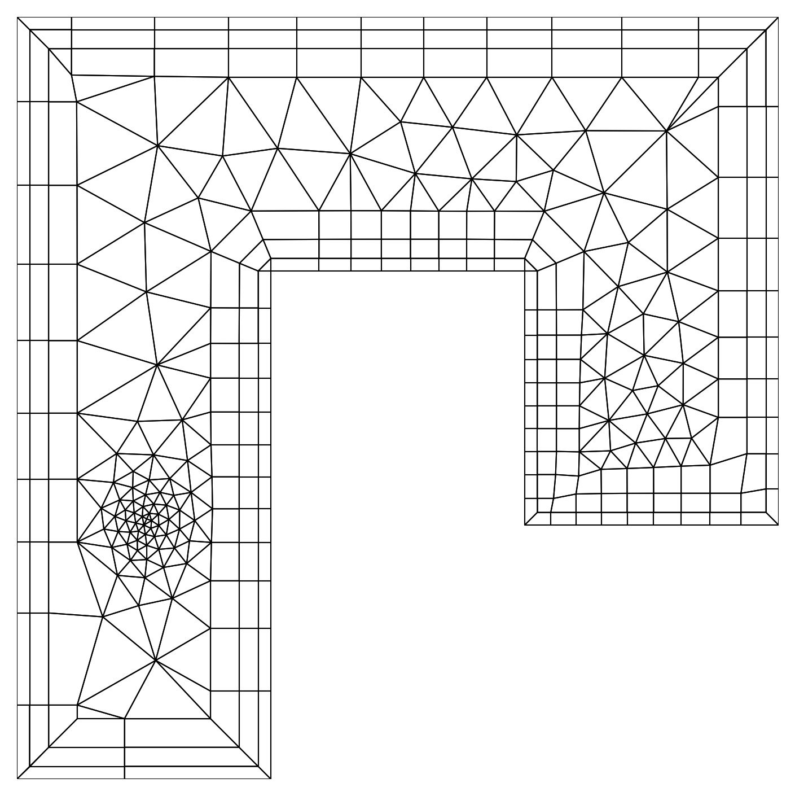
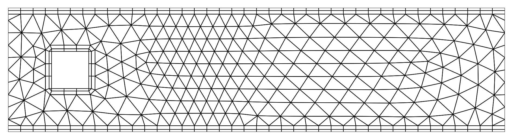
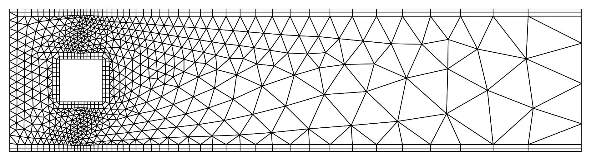
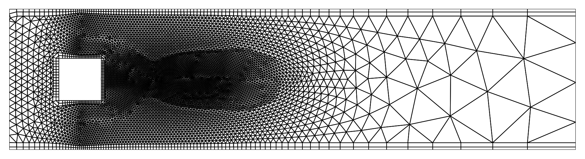
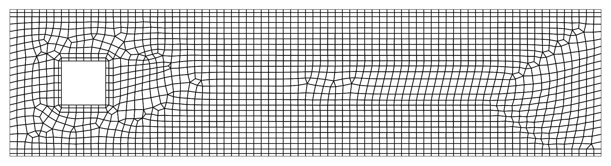

# TQMesh
-----------------------


**TQMesh** is a simple C++ program for the generation of two-dimensional 
meshes, that consist of triangles and quadrilaterals.
The application is intended for learning purposes, for example to create two-dimensional 
grids for Computational Fluid Dynamics or Finite Element Methods without much effort.
The elements are generated with an advancing-front method, where the user must 
define the edge segments that define the boundary of the domain to tesselate. 
A user-defined size function makes it very easy to adjust the element size locally.
**TQMesh** also offers the possibility to treat the near boundary region explicitly 
by quadrilateral elements, which can be especially interesting for discretizing 
Computational Fluid Dynamics problems.



## Installation
**TQMesh** is basically a header-only library, which requires the files in the directories
*src/algorithm* and *src/utils*.
The directory *src/app* contains the code for the **TQMesh** application, that is described below.
To its installation, simply create a build directory and run 
```sh
cmake ..
make install
```

## Usage of TQMesh
The **TQMesh** application requires a parameter file as input for the mesh generation.
There are some sample files given in the *input/* directory.
Basically, one only needs to define a few global parameters and the mesh boundaries in terms
of boundary nodes and edges. 
There is the possibility to assign markers to each defined boundary-edge. These markers 
are then assigned to the final mesh boundary edges.
Here is a simple example to create the shown mesh of a cylinder in a two-dimensional channel.

``` sh
#-----------------------------------------------------------
#                          TQMESH     
#-----------------------------------------------------------
Element size: 0.05 
Element type: Triangle 

#-----------------------------------------------------------
#                         VERTICES     
# Arguments:
#   1) X-coordinate
#   2) Y-coordinate
#   3) Scale parameter
#   3) Range parameter
#-----------------------------------------------------------
Define vertices
  0.0,   0.0,   1.0,  1.0     # 0
  4.0,   0.0,   1.0,  1.0     # 1
  4.0,   1.0,   1.0,  1.0     # 2
  0.0,   1.0,   1.0,  1.0     # 3
  0.35,  0.35,  1.0,  1.0     # 4
  0.35,  0.65,  1.0,  1.0     # 5
  0.65,  0.65,  1.0,  1.0     # 6
  0.65,  0.35,  1.0,  1.0     # 7
End vertices

#-----------------------------------------------------------
#                        BOUNDARIES     
# Arguments:
#   1) Index of starting vertex
#   2) Index of ending vertex
#   3) Boundary marker
#
# > All boundaries must be closed 
# > Exterior boundaries must be defined counter-clockwise
# > Interior boundaries must be defined clockwise
#-----------------------------------------------------------
Define exterior boundary
 0,  1,  2  # Domain Wall 
 1,  2,  3  # Outlet
 2,  3,  2  # Domain Wall
 3,  0,  1  # Inlet
End exterior boundary

Define interior boundary
 4,  5,  4  # Rectangle Wall
 5,  6,  4  # Rectangle Wall
 6,  7,  4  # Rectangle Wall
 7,  4,  4  # Rectangle Wall
End interior boundary

#-----------------------------------------------------------
#                       QUAD-LAYERS     
# Arguments: 
#   1) Starting vertex
#   2) Ending vertex
#   3) Number of layers
#   4) First layer height
#   5) Growth ratio
#
# > The given start and ending vertices must be connected
#   by boundary edges
# > A closed layer of quadrilateral elements will be
#   generated if the same start and ending vertex is 
#   provided
#-----------------------------------------------------------
Add quad layers: 0, 1, 2, 0.02, 1.5
Add quad layers: 2, 3, 2, 0.02, 1.5
Add quad layers: 4, 4, 2, 0.02, 1.5
```
The mesh is created with 
```sh
./bin/TQMesh input/RectangleMesh.para > Mesh.dat
```
The mesh will be written to the file `Mesh.dat` in a simple ASCII format.

It is even possible to provide simple size function expressions 
through the input file by simply passing it through the element size
parameter:
``` sh
Element size: 0.02 + 0.075 * sqrt( (x-0.5)*(x-0.5) ) 
``` 
The effect of the refinement is shown here:



It is possible to define vertices with corresponding element sizings in the domain. 
This can for example also be used to refine the field locally.
``` sh
#-----------------------------------------------------------
#                      FIXED VERTICES     
# Arguments:
#   1) X-coordinate
#   2) Y-coordinate
#   3) Scale parameter
#   4) Range parameter
#-----------------------------------------------------------

Define fixed vertices
    1.00,     0.50,   0.3,  0.75
    1.50,     0.50,   0.3,  0.75
    2.00,     0.50,   0.3,  0.75
End fixed vertices

``` 



Of course, we can also discretize the domain with Quadrilateral elements. 
Simply change the element type in the input file to:
``` sh
Element type: Quadrilateral 
``` 


## Output format
Currently, **TQMesh** only features a simple output format,
which is defined in the following way:
``` sh
VERTICES 5741            # The total number of mesh vertices
-22.00000, 9.72407       # Coordinates of vertex 1
-22.00000, 9.43624       # Coordinates of vertex 2
...
INTERIOREDGES 13575      # The total number of interior mesh edges
976, 43, -1              # The edge connects vertex 976 & 43 and has marker -1
...
BOUNDARYEDGES 975        # The total number of boundary mesh edges
41, 42, 1                # The edge connects vertex 41 & 42 and has marker 1
733, 734, 2              # The edge connects vertex 733 & 734 and has marker 2
...
FRONT 0                  # Remaining advancing front edges after a failed meshing attempt
QUADS 1700               # The total number of quadrilateral elements
42, 43, 976, 975         # Quadrilateral made up of vertices 42, 43, 976 & 975
...
TRIANGLES 7111           # The total number of triangular elements
40, 41, 42               # Triangle made up of vertices 40, 41 & 42
...
QUADNEIGHBORS 1700       # 
1, 709, 358, -1          # Element indices of the neighbors of quadrilateral 1
2, 359, 0, -1            # The index -1 indicates a mesh boundary adjacency
TRIANGLENEIGHBORS 7111   # 
197, 550, 196            # Element indices of the neighbors of triangle 1
1377, 2492, -1           # The index -1 indicates a mesh boundary adjacency 
...                      # 
SIZE-FUNCTION 0.00000 0.00000 14.00000 10.00000 100 100 
0.20519,0.22794,0.25070,0.27346,0.29623,0.31902,0.34182,0.36466,0.38754,0.41050
...
```
For the adjacency lists, quadrilateral and triangular elements are indexed together. 
This means, for example, if the mesh consists of 400 triangles and 300 quads, then quad 1 
has element index 1 and triangle 1 has element index 401.
At the end of the mesh output, the size function is returned. In the example above, it
is resolved over a rectangular area (0,0) x (14,10) with 100 x 100 points.
The floating point numbers below represent the corresponding entries of the size function array.

## Plot your meshes
A simple python script to plot your mesh is provided under `scripts/plot_mesh.py`.
Run the script with
```sh
python scipts/plot_mesh.py Mesh.dat
```
You can use the script with the optional flag `-s` in order to plot the 
underlying size function of the mesh.


## Usage of the TQMesh library
Several examples on how to use the **TQMesh**-library functions are given in 
*src/tests/mesh_test.cpp*.

## Tests / Benchmarks
**TQMesh** uses a customized QuadTree container structure to store and access 
all mesh entities. 
The following plots show some performance statistics that have been gathered with 
the test functions `run_qtree_tests()` and `run_mesh_tests()`.

 

## To Do's
* Boundary elements (e.g. circle, triangle, rectangle) for an easier definition of domain boundaries
* Delaunay refinement for bad / highly skewed elements
* Export to different mesh output formats
* Improved documentation / testing

Feel free to contribute!

## Libraries used
* [exprtk.h - C++ Mathematical Expression Toolkit Library](http://www.partow.net/programming/exprtk/index.html)

## Sources
* o'Rourke, Joseph. Computational geometry in C. Cambridge university press, 1998.
* [Shewchuk, Jonathan R. Lecture Notes on Delaunay Mesh Generation, February 5, 2012](https://people.eecs.berkeley.edu/~jrs/meshpapers/delnotes.pdf)
* [Jonathan R. Shewchuk's free course material on Mesh Generation and Geometry Processing in Graphics, Engineering, and Modeling ](https://people.eecs.berkeley.edu/~jrs/mesh/)
* Lo, Daniel SH. Finite element mesh generation. CRC Press, 2014
* Blazek, Jiri. Computational fluid dynamics: principles and applications. Butterworth-Heinemann, 2015
* [Zhou and Shimada, An Angle-Based Approach to Two-Dimensional Mesh Smoothing, IMR 2000, 373-384, 2000](https://www.researchgate.net/profile/Kenji-Shimada-2/publication/221561796_An_Angle-Based_Approach_to_Two-Dimensional_Mesh_Smoothing/links/0deec53988e9f560ec000000/An-Angle-Based-Approach-to-Two-Dimensional-Mesh-Smoothing.pdf) 

## Licences
The project is licensed under the MIT License - see the LICENSE file for details.


