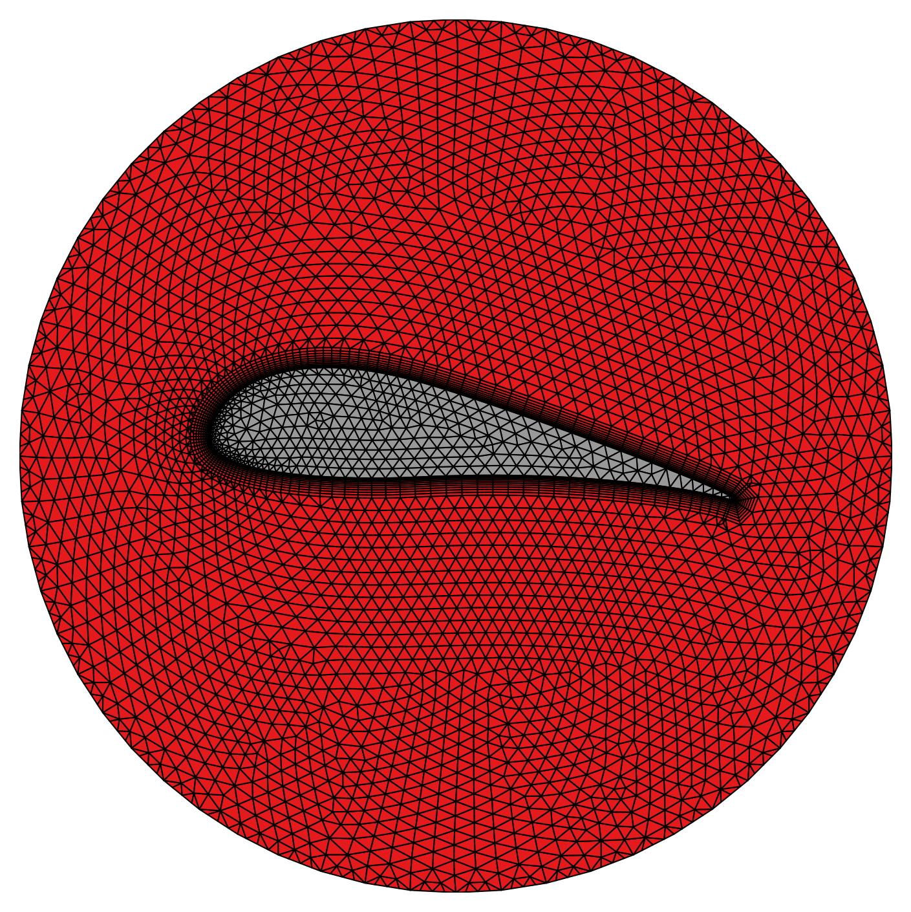
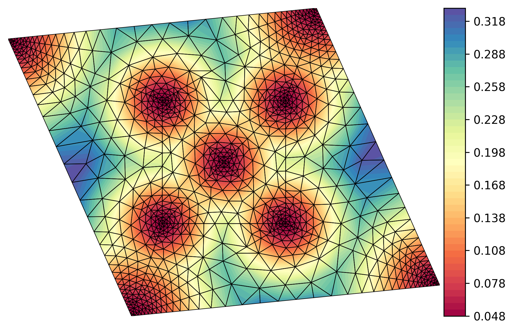
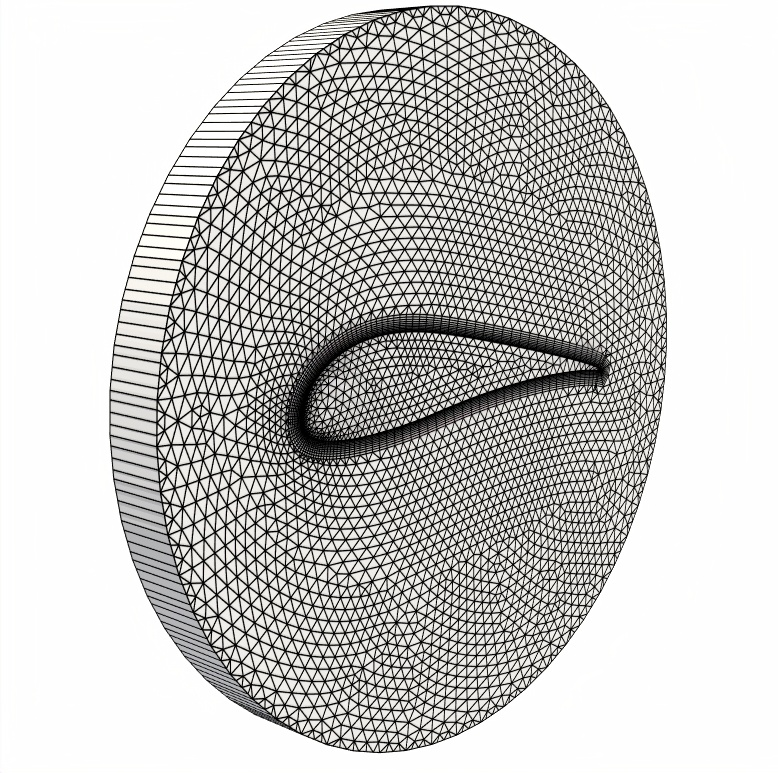

# TQMesh: Simplifying Two-Dimensional Mesh Generation
-----------------------


**TQMesh** is a simple C++ library/application designed to streamline the process 
of generating two-dimensional meshes comprising triangles and quadrilaterals. 
Whether you're involved in Computational Fluid Dynamics (CFD), Finite Element Methods (FEM), 
or other fields, this tool simplifies the creation of grids for various applications.

## Key Features

- **Effortless Element Generation:** TQMesh employs an advancing-front method, 
requiring users to define edge segments that outline the domain. This automated approach ensures smooth and accurate mesh generation.

- **Localized Element Sizing:** Customize mesh properties effortlessly using the user-defined 
size function. Achieve precise control over element sizing, allowing you to adapt the mesh to your specific needs.

- **Boundary Flexibility:** Beyond triangles, TQMesh introduces the option of including quadrilateral 
elements along the near boundary region. This is particularly advantageous for enhancing mesh accuracy in various scenarios 
(e.g. to resolve boundary layers in fluid dynamics problems).


## Installation

**TQMesh** is a header-only library, which requires the files in the directories *src/algorithm* and *src/utils*. 
Simply include these files in your projects and start meshing!

The directory *src/app* contains the code for the application. 
To install it, follow these steps:

1. Clone the repository to your local machine:

   ```sh
   git clone https://github.com/FloSewn/TQMesh
   cd TQMesh  # Enter the project directory
   ```
2. Create a build directory:
   ```sh
   mkdir build
   cd build
   ```
3. Configure the build using CMake
   ```sh
   cmake ..
   ```
   If you want to use a specific compiler (e.g. clang), specify it during CMake configuration:
   ```
   cmake -DCMAKE_CXX_COMPILER=<your-compiler> ..
   ```
   If you'd like to run in debug mode, use the additional flag `-DCMAKE_BUILD_TYPE=Debug` during the CMake configuration.

4. Build and install TQMesh:
   ```
   make install 
   ```
   
And that's it! TQMesh is now installed and ready to be used. 

## Usage of the TQMesh library
The **TQMesh** library comes with a set of examples showcasing how to utilize its functions. 
These examples can be found in the *src/examples* directory of the project.

After successfully installing TQMesh, you can run these examples using the provided tool:

1. Navigate to the main project directory in your terminal:
   ```sh
   cd TQMesh  # Enter the project directory
   ```

2. Run the examples tool along with the desired example identifier:
   ```sh
   ./bin/run_examples <Example-ID>
   ```
   Replace `<Example-ID>` with the specific example identifier you want to run.


## Usage of the TQMesh application
The **TQMesh** application uses simple parameter files as input for the mesh generation.
There are some sample files given in the *input/* directory.

To use the application, navigate to your main project directory in your terminal and run: 
```sh
./bin/TQMesh <Input-file> 
```
Replace `<Input-file>` with the name of your chosen input parameter file.

## Examples
Generating a mesh with **TQMesh** is a straightforward process that involves defining a few key global parameters 
along with mesh boundaries represented by boundary nodes and edges. You have the option to assign markers 
to each boundary edge, which are then applied to the final mesh's boundary edges. 
Furthermore, the application supports creating multiple meshes consecutively, 
each with assigned color values for its elements.

Explore the examples below to get an overview of **TQMesh**'s capabilities.
You can find both the example input files and their corresponding 
results in the *input/* and *src/examples* directories.


<details>
<summary>Local mesh refinement</summary>

**TQMesh** combines a simple definition of mesh domain boundaries with a versatile specification of the 
element size. The latter is either determined by the domain's edge segments, 
through sizing factors that are attributed to boundary vertices or via user-defined size functions.


</details>

<details>
<summary>Quad layers and subdivision</summary>

**TQMesh** also features the generation of quadrilateral elements, as well as layers of quad elements in the vicinity of boundaries.
This example mesh was created by using the paving algorithm (which generates mixed-element meshes that are dominated by quads) and a subsequent quad-refinement of all elements.
In this way, it is possile to generate elements that consist only of quadrilaterals.


</details>

<details>
<summary>Boundary shapes</summary>

It is possible to create meshes through predefined boundary shapes, such as rectangles, circles or triangles.


</details>

<details>
<summary>Local mesh refinement and element coloring</summary>

During the meshing process, each element gets an associated color value. 
These colors can be adjusted during the meshing process, as indicated in this example.
It also possible to define interior mesh vertices, in order to influence the local element refinement, as shown below.


</details>

<details>
<summary>Merge meshes</summary>

**TQMesh** gives the possibility to create and merge several meshes, preserving the conformity of their boundary edges.
This makes it even easier to assign different color values to different element areas in the domain.
This example shows the output from a successive mesh generation.


</details>

<details>
<summary>Import boundaries from CSV files</summary>

In case you want to automate the meshing process, **TQMesh** offers the possibility to import boundary definitions
via CSV files. This example shows an airfoil that has been meshed in this way.


</details>


<details>
<summary>Fixed interior edges</summary>

Fixed edges can be defined within the domain to guide the meshing process.


</details>

## Output format
Currently, **TQMesh** features the VTU output format (which can be read for example by Paraview) or alternatively a simple text output format.

<details>
<summary>More infos about the text output format </summary>

The following sample text output was generated for this mesh:


``` sh
MESH 1
VERTICES 9            # The total number of mesh vertices
1.00000,0.00000       # Coordinates of vertex 0
1.50000,0.00000       # Coordinates of vertex 1
2.00000,0.00000       # ...
2.00000,0.50000
2.00000,1.00000
1.50000,1.00000
1.00000,1.00000
1.00000,0.50000
1.50000,0.33319
INTERIOREDGES 5       # The total number of interior mesh edges 
   5,   7,   1,   4   # The first edge connects vertex 5 & 7 and has the
   7,   8,   1,   0   # adjacent elements (1,4) to the left and right of it
   3,   5,   1,   3   # ...
   3,   8,   2,   1
   8,   1,   2,   0
BOUNDARYEDGES 8       # The total number of boundary mesh edges
   0,   1,   0,   2   # The first edge connects vertex 0 & 1, is 
   1,   2,   2,   2   # adjacent to element 0 and has marker 2
   2,   3,   2,   2   # .....
   3,   4,   3,   2
   4,   5,   3,   2
   5,   6,   4,   2
   6,   7,   4,   1
   7,   0,   0,   1
INTERFACEEDGES 2          # The total number of interface edges between two neighboring meshes
   6,   7,   4,   2,   2  # This interface edge connects vertices 6 and 7. It is adjacent to 
   7,   0,   0,   1,   2  # element 4 of this mesh and to element 2 of another mesh with index 2
FRONT 0                   # Remaining advancing front edges after a failed meshing attempt
QUADS 3                   # The total number of quadrilateral elements
   0,   1,   8,   7,   2  # Quadrilateral made up of vertices 0, 1, 8 & 7. 
   7,   8,   3,   5,   2  # The quad has the color value 2
   8,   1,   2,   3,   2  # ...
TRIANGLES 2               # The total number of triangular elements
   3,   4,   5,   2       # Triangle made up of vertices 3, 4 & 5. Its color value is 2
   5,   6,   7,   2       # ...
QUADNEIGHBORS 3
   2,   1,  -1,  -1       # Element indices from the neighbors of quadrilateral 0
   2,   3,   4,   0       # The index -1 indicates a mesh boundary adjacency
  -1,  -1,   1,   0       
TRIANGLENEIGHBORS 2
  -1,   1,  -1            # Element indices of the neighbors of triangle 0
  -1,   1,  -1            # The index -1 indicates a mesh boundary adjacency 
SIZEFUNCTION 9            
0.50000                   # Size function value of vertex 0
0.50000                   # Size function value of vertex 1 
0.50000                   # ...
0.50000
0.50000
0.50000
0.50000
0.50000
0.50000
```
For the adjacency lists, quadrilateral and triangular elements are indexed together. 
This means, for example, if the mesh consists of 400 triangles and 300 quads, then quad 1 has element index 1 and triangle 1 has element index 401.
The last entry of the mesh output refers to the size function values at every vertex of the mesh.

</details>

## Convert meshes for OpenFOAM


To convert meshes from **TQMesh** to a format that is supported by OpenFOAM
you can use a script that is provided in `scripts/convert2foam.py`.
```sh
python scripts/convert2foam.py [-e EXTRUSION] Mesh.txt export-prefix
```
This script simply extrudes the provided mesh into the z-direction and 
generates the required files which can be used as input for OpenFOAM.

## Plot your meshes
A simple python script to plot your mesh is provided under `scripts/plot_mesh.py`.
It requires the mesh given in the format described above.
Simply run it with
```sh
python scripts/plot_mesh.py Mesh.txt (-s -v -e -b -f)
```
Optional flags: 
* `-s`: Add a contour plot of the underlying size-function
* `-c`: Plot elements with their respective color values
* `-v`: Add the mesh vertices and their indices to the plot
* `-e`: Add the mesh element indices to the plot
* `-b`: Highlight the mesh boundaries 
* `-f`: Highlight remaining advancing front edges (in case of a failed meshing attempt) 


## Tests / Benchmarks
**TQMesh** uses a customized QuadTree container structure to store and access all mesh entities. 
The following plots show some performance statistics.

 

## To Do's
* Enhanced quad triangle-to-quad morphing
* Boundary definition via splines
* Improved documentation / testing

Feel free to contribute!

## Libraries used
* [exprtk.h - C++ Mathematical Expression Toolkit Library](http://www.partow.net/programming/exprtk/index.html)

## Sources
* o'Rourke, Joseph. Computational geometry in C. Cambridge university press, 1998.
* [Shewchuk, Jonathan R. Lecture Notes on Delaunay Mesh Generation, February 5, 2012](https://people.eecs.berkeley.edu/~jrs/meshpapers/delnotes.pdf)
* [Jonathan R. Shewchuk's free course material on Mesh Generation and Geometry Processing in Graphics, Engineering, and Modeling ](https://people.eecs.berkeley.edu/~jrs/mesh/)
* Lo, Daniel SH. Finite element mesh generation. CRC Press, 2014
* Blazek, Jiri. Computational fluid dynamics: principles and applications. Butterworth-Heinemann, 2015
* [Zhou and Shimada, An Angle-Based Approach to Two-Dimensional Mesh Smoothing, IMR 2000, 373-384, 2000](https://www.researchgate.net/profile/Kenji-Shimada-2/publication/221561796_An_Angle-Based_Approach_to_Two-Dimensional_Mesh_Smoothing/links/0deec53988e9f560ec000000/An-Angle-Based-Approach-to-Two-Dimensional-Mesh-Smoothing.pdf) 

## Licences
The project is licensed under the MIT License - see the LICENSE file for details.

